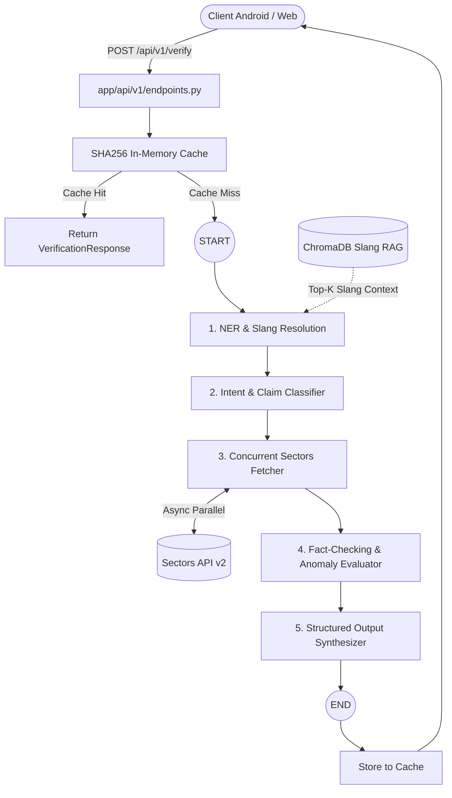

# Tilik AI - Architecture & Agent Guidelines (`AGENTS.md`)

Selamat datang di repository **Tilik AI — In-Context Financial Fact-Checker & Slang RAG Engine for IDX Stocks**. Dokumen ini adalah panduan arsitektur, standar kode, dan pemetaan file untuk AI Agent maupun developer yang bekerja pada codebase ini sesuai spesifikasi resmi `PRD_BACKEND_LANGCHAIN_SECTORS.md`.

---

## 1. Tech Stack Overview

| Komponen | Teknologi | Keterangan |
| :--- | :--- | :--- |
| **Backend Framework** | Python 3.11+ / FastAPI | Async REST API gateway & Lifespan |
| **AI Agent Workflow** | LangGraph 0.2+ | StateGraph, sequential pipeline, anomaly evaluator |
| **LLM Provider** | Google Gemini (`gemini-2.0-flash`) | NER slang resolution, reasoning, prompt generator |
| **Slang RAG Engine** | ChromaDB / Vector Store | Semantic search kamus istilah gaul & julukan emiten |
| **Financial Data** | Sectors API v2 | Profil emiten, valuasi peers, broker flow, foreign flow |
| **Cache Layer** | In-Memory TTL Cache (SHA256) | Zero-duplicate inference untuk cuitan berulang |
| **Configuration** | Pydantic Settings (`pydantic-settings`) | Type-safe environment config dari `.env` |
| **Testing** | Pytest + pytest-asyncio + httpx | Unit test RAG, LangGraph workflow, & API integration |
| **Container** | Docker & Docker Compose | Containerized dev/prod deployment |

---

## 2. Folder & File Mapping

```text
E:\tilik-ai\
├── data/
│   ├── slang_dictionary.csv        # Database CSV kamus slang pasar modal Indonesia
│   └── seed_slang.py               # Skrip inisialisasi & validasi data CSV
├── app/
│   ├── __init__.py
│   ├── main.py                     # FastAPI application factory, CORS & Lifespan
│   ├── core/
│   │   ├── __init__.py
│   │   ├── config.py               # Pydantic-settings (.env configuration)
│   │   ├── cache.py                # In-memory SHA256 caching layer (TTLCache)
│   │   └── security.py             # Basic rate limiting & request validator
│   ├── models/
│   │   ├── __init__.py
│   │   ├── schemas.py              # Pydantic v2 Request, Response, Level 1 & Level 2
│   │   └── state.py                # LangGraph AgentState TypedDict
│   ├── rag/
│   │   ├── __init__.py
│   │   ├── slang_store.py          # Vector store manager (ChromaDB)
│   │   └── retriever.py            # Hybrid semantic retrieval untuk slang bursa
│   ├── agent/
│   │   ├── __init__.py
│   │   ├── graph.py                # Kompilasi LangGraph StateGraph
│   │   ├── nodes.py                # Implementasi logika setiap node workflow
│   │   └── prompts.py              # System prompts deterministik untuk Gemini
│   ├── services/
│   │   ├── __init__.py
│   │   └── sectors_client.py       # Asynchronous Sectors API v2 HTTP client (httpx)
│   └── api/
│       ├── __init__.py
│       └── v1/
│           ├── __init__.py
│           └── endpoints.py        # Router: POST /api/v1/verify & GET /api/v1/health
├── tests/
│   ├── __init__.py
│   ├── conftest.py                 # Pytest fixtures & mock Sectors API data
│   ├── test_rag.py                 # Pengujian semantic search slang CSV (30 frasa)
│   ├── test_agent.py               # Pengujian eksekusi LangGraph workflow & fallback
│   └── test_api.py                 # Pengujian integrasi endpoint FastAPI
├── .env.example
├── Dockerfile
├── docker-compose.yml
├── requirements.txt
└── README.md                       # HANYA: 1. Pengertian, 2. Cara Install (venv & Docker)
```

---

## 3. Detail Tanggung Jawab Modul

### `app/api/v1/endpoints.py` (Unified Gateway)
- **`POST /api/v1/verify`**: Single unified endpoint menerima raw tweet (`VerifyTweetRequest`), memeriksa rate limiting, SHA256 cache, menjalankan workflow LangGraph, dan mengembalikan `VerificationResponse` (Level 1 card + Level 2 expanded data).
- **`GET /api/v1/health`**: Memeriksa kesiapan aplikasi, status Gemini API, Sectors API, dan total entri RAG slang.

### `app/rag/` (Slang RAG Subsystem)
- **`slang_store.py`**: Mengelola pembacaan `data/slang_dictionary.csv`, inisialisasi ChromaDB vector store, dan warmup model.
- **`retriever.py`**: Hybrid retrieval menggabungkan exact substring matching dan semantic search untuk mengidentifikasi slang bursa dan emiten terkait dalam < 300 ms.

### `app/services/sectors_client.py` (Sectors API v2)
- Menggunakan `httpx.AsyncClient` dengan header `Authorization: <SECTORS_API_KEY>` (tanpa awalan `Bearer`).
- **Credit Optimization**: Wajib menggunakan parameter `?sections=overview,valuation,financials,peers` pada `/v2/company/report/{symbol}/` untuk menghemat kuota menjadi 4 credits.
- Query paralel untuk laporan kuartalan, top broker summary, arus dana asing (foreign flow), dan status suspensi/FCA.

### `app/agent/` (LangGraph Reasoning Engine)
- **`ner_slang_node`**: Mengekstrak kode saham (ticker), nama emiten, julukan/slang, dan klaim teks.
- **`intent_node`**: Mengklasifikasikan kategori klaim (`VALUATION`, `FLOW`, `EARNINGS`, `RISK`).
- **`concurrent_fetch_node`**: Menjalankan fetch data Sectors API secara paralel (`asyncio.gather`).
- **`evaluator_node`**: Membandingkan klaim narasi vs data fundamental riil (komparasi PBV/PE median sektor, foreign flow, top broker, status FCA) dan menentukan verdict (`RED`, `YELLOW`, `GREEN`).
- **`synthesizer_node`**: Membangun payload terstruktur Level 1 (fakta kunci maks 25 kata/150 karakter) dan Level 2 (rincian angka mendalam zero-latency).

---

## 4. Alur Kerja Arsitektur (End-to-End Flow)



---

## 5. Menjalankan Server & Testing

### Menjalankan Server Lokal (venv)
```bash
# Aktifkan virtual environment
.\venv\Scripts\Activate.ps1   # Windows
source venv/bin/activate      # Linux/macOS

# Jalankan server FastAPI
uvicorn app.main:app --reload --port 8000
```
Swagger UI tersedia di `http://localhost:8000/docs`.

### Menjalankan Pengujian Otomatis (`pytest`)
```bash
# Menjalankan seluruh test suite
pytest tests/ -v

# Menjalankan spesifik test module
pytest tests/test_rag.py -v
pytest tests/test_agent.py -v
pytest tests/test_api.py -v
```

---

## 6. Aturan dan Konvensi Pengembangan bagi AI Agent

1. **Separation of Concerns**:
   - Seluruh logika RAG diisolasi di `app/rag/`.
   - Seluruh komunikasi HTTP eksternal wajib melalui `app/services/sectors_client.py`.
   - Logika reasoning terpusat di `app/agent/nodes.py`.
2. **Asynchronous First**:
   - Seluruh I/O jaringan dan graph invocation wajib beroperasi secara asinkron (`async`/`await`).
3. **Pydantic v2 Validation**:
   - Skema kontrak data (`app/models/schemas.py`) divalidasi ketat. Tidak boleh mengubah nama atribut atau tipe data tanpa persetujuan PRD.
4. **Resilience & Graceful Fallback**:
   - Apabila koneksi Sectors API timeout atau API key Gemini tidak tersedia, sistem tetap harus mengembalikan respons fallback valid dan tidak menghasilkan HTTP 500 error.
5. **100% Test Passing Requirement**:
   - Seluruh 41 test case di `tests/` wajib lulus 100% sebelum commit atau push.
