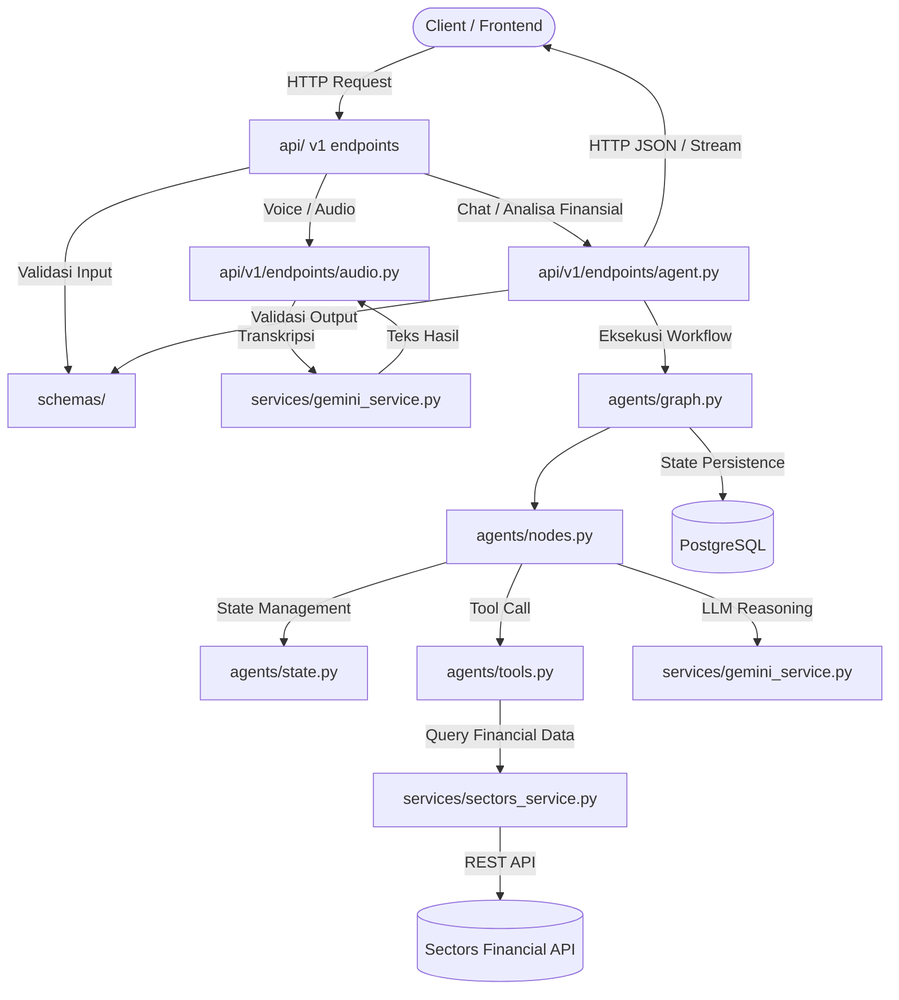

# Tilik AI - Architecture & Agent Guidelines (`AGENTS.md`)

Selamat datang di repository **Tilik AI**. Dokumen ini adalah panduan arsitektur, standar kode, dan pemetaan file untuk AI Agent maupun developer yang bekerja pada codebase ini.

---

## 1. Tech Stack Overview

| Komponen | Teknologi | Keterangan |
| :--- | :--- | :--- |
| **Backend Framework** | Python 3.11+ / FastAPI | Async REST API & streaming |
| **AI Agent Workflow** | LangGraph + LangChain | StateGraph, agent loop, tool execution |
| **LLM Provider** | Google Gemini (`gemini-2.0-flash` dsb.) | Reasoning, prompt generation, NLP |
| **Audio-to-Text** | Google Gemini (Multimodal / Audio) | Voice notes / audio transcription |
| **Financial Data** | Sectors API (REST / MCP) | Data pasar saham, IDX, metrik finansial |
| **Database** | PostgreSQL 16 (Container) | State persistence, user data, audit logs |
| **Configuration** | Pydantic Settings (`pydantic-settings`) | Type-safe config dari `.env` |
| **Testing** | Pytest + pytest-asyncio + httpx | Unit, integration, & schema tests |
| **Container** | Docker & Docker Compose | Dev container with hot-reload (`uvicorn --reload`) |

---

## 2. Folder & File Mapping

```text
tilik-ai/
├── api/                        # Layer penerima HTTP Request (FastAPI Routers)
│   ├── __init__.py
│   └── v1/
│       ├── __init__.py
│       ├── router.py           # Agregator seluruh router v1
│       └── endpoints/
│           ├── __init__.py
│           ├── agent.py        # Endpoint interaksi AI agent (chat/stream)
│           ├── audio.py        # Endpoint upload & transkripsi audio (Gemini)
│           ├── financial.py    # Endpoint data finansial (Sectors API)
│           └── health.py       # Endpoint health check & status sistem
├── services/                   # Layer komunikasi ke External API & Services
│   ├── __init__.py
│   ├── gemini_service.py       # Service client LLM & Audio-to-Text Gemini
│   └── sectors_service.py      # Service client Sectors API (REST/MCP)
├── agents/                     # Layer reasoning & workflow AI (LangGraph)
│   ├── __init__.py
│   ├── state.py                # Definisi AgentState (TypedDict/Pydantic)
│   ├── nodes.py                # Logika setiap node dalam graph (reasoner, tool executor)
│   ├── tools.py                # Definisi tool (Sectors query, calculator, dsb.)
│   └── graph.py                # Assembling & kompilasi StateGraph
├── schemas/                    # Layer Data Validation (Pydantic Models)
│   ├── __init__.py
│   ├── agent.py                # Schema request/response interaksi agent
│   ├── audio.py                # Schema input/output audio transkripsi
│   ├── financial.py            # Schema data finansial & payload Sectors API
│   └── common.py               # Schema generic (Response wrapper, error format)
├── core/                       # Core configurations & Database engine
│   ├── __init__.py
│   ├── config.py               # Pydantic Settings & environment loader
│   └── database.py             # SQLAlchemy Async Engine & Session maker
├── tests/                      # Test Suite (Pytest)
│   ├── __init__.py
│   ├── conftest.py             # Fixtures, test client, mock data
│   ├── test_health.py          # Uji endpoint health check
│   ├── test_agents.py          # Uji graph, state transitions, agent nodes
│   ├── test_services.py        # Uji client service external (Gemini, Sectors)
│   └── test_schemas.py         # Uji validasi input/output schema
├── Dockerfile.dev              # Container development FastAPI (hot-reload)
├── docker-compose.yml          # Orkestrasi container App + PostgreSQL
├── .pre-commit-config.yaml     # Konfigurasi git hooks (Ruff, YAML check, formatting)
├── .env.example                # Template environment variables
├── .dockerignore               # Docker ignore rules
├── .gitignore                  # Git ignore rules
├── requirements.txt            # Python dependencies
├── main.py                     # Entrypoint aplikasi FastAPI
├── README.md                   # Penjelasan repo & panduan instalasi Docker
└── AGENTS.md                   # Dokumen panduan arsitektur (File ini)
```

---

## 3. Detail Tanggung Jawab Tiap File

### `api/` (Presentation & Routing)
- **`api/v1/router.py`**: Menggabungkan router dari sub-modul di `api/v1/endpoints/` dengan prefix `/api/v1`.
- **`api/v1/endpoints/agent.py`**: Menerima request prompt user, memanggil graph di `agents/graph.py`, dan mengembalikan response stream / full answer.
- **`api/v1/endpoints/audio.py`**: Menerima file audio (multipart/form-data), memanggil `services/gemini_service.py` untuk konversi audio ke teks.
- **`api/v1/endpoints/financial.py`**: Endpoint khusus untuk query langsung data saham / laporan keuangan melalui `services/sectors_service.py`.
- **`api/v1/endpoints/health.py`**: Endpoint pengecekan status server dan koneksi PostgreSQL.

### `services/` (External Integrations)
- **`services/gemini_service.py`**: Menangani inisialisasi client Gemini (Google GenAI / LangChain Google GenAI), inference teks, dan parsing audio.
- **`services/sectors_service.py`**: Menangani panggilan HTTP (menggunakan `httpx` async) ke REST API Sectors atau integrasi MCP client untuk data bursa saham.

### `agents/` (Reasoning & Orchestration)
- **`agents/state.py`**: Menyimpan struktur state percakapan, memory, konteks finansial, dan histori pesan (`AgentState`).
- **`agents/nodes.py`**: Fungsi-fungsi node untuk Graph (misal: node klasifikasi niat, node analisa finansial, node pemanggilan tool, node formatting).
- **`agents/tools.py`**: Definisi `@tool` LangChain/LangGraph yang menghubungkan agent ke `services/sectors_service.py`.
- **`agents/graph.py`**: Merangkai alur conditional edge, entry point, dan mengompilasi graph runnable (`app = workflow.compile()`).

### `schemas/` (Data Contracts)
- **`schemas/agent.py`**: Request payload (`AgentQueryRequest`), response payload (`AgentQueryResponse`), streaming chunks.
- **`schemas/audio.py`**: Request transkripsi, metadata file audio, dan output teks transkripsi.
- **`schemas/financial.py`**: Model representasi data emiten saham, rasio keuangan, valuasi, dsb.
- **`schemas/common.py`**: Struktur standar response API `{ "status": "success", "data": ..., "message": ... }` dan penanganan error.

### `core/` (Configurations)
- **`core/config.py`**: Class `Settings(BaseSettings)` yang membaca `.env` untuk API Keys, DB Credentials, dan konfigurasi server.
- **`core/database.py`**: Konfigurasi koneksi async PostgreSQL menggunakan `asyncpg` dan session provider.

---

## 4. Alur Kerja Arsitektur (Architecture Flow)



---

## 5. Menjalankan Versi Development (Docker)

### Prasyarat
1. Salin file environment:
   ```bash
   cp .env.example .env
   ```
2. Isi nilai API key pada `.env` (`GEMINI_API_KEY`, `SECTORS_API_KEY`).

### Menjalankan Container
```bash
# Build dan jalankan container app & postgres
docker compose up --build

# Menjalankan di background (detached mode)
docker compose up -d

# Memeriksa log aplikasi
docker compose logs -f app
```

- **FastAPI Dev Server**: `http://localhost:8000`
- **Interactive Swagger Docs**: `http://localhost:8000/docs`
- **PostgreSQL Port**: `localhost:5432`

---

## 6. Aturan dan Konvensi Pengembangan bagi AI Agent

1. **Pemisahan Tanggung Jawab (Separation of Concerns)**:
   - Jangan meletakkan logika bisnis atau pemanggilan API external langsung di dalam handler `api/`. Selalu delegasikan ke `services/` atau `agents/`.
   - Selalu gunakan model Pydantic di `schemas/` untuk request body, query params, dan response body.

2. **Asynchronous First**:
   - Seluruh endpoint dan service I/O (Gemini, Sectors API, Database) wajib menggunakan `async`/`await` dan HTTP client async (`httpx.AsyncClient`).

3. **LangGraph State Immutability**:
   - Perbarui state melalui return dictionary dari masing-masing node, jangan mengubah mutable state secara direct tanpa melalui reducers.

4. **Kerahasiaan Credentials**:
   - Tidak boleh melakukan hardcode API Key atau password di dalam kode sumber. Gunakan `core/config.py` yang terhubung dengan `.env`.

5. **Testing & Code Quality**:
   - Setiap fitur atau endpoint baru wajib memiliki file pengujian di folder `tests/`.
   - Seluruh automated tests (`pytest`) wajib lulus sebelum perubahan dapat di-commit atau di-push ke repository.
   - Pre-commit & pre-push hooks dikonfigurasi untuk menjalankan linter/formatter (Ruff) dan Pytest secara otomatis:
     ```bash
     # Install git hooks (pre-commit & pre-push)
     pre-commit install --hook-type pre-commit --hook-type pre-push

     # Jalankan manual semua hook (termasuk Pytest)
     pre-commit run --all-files --hook-stage pre-push
     ```


