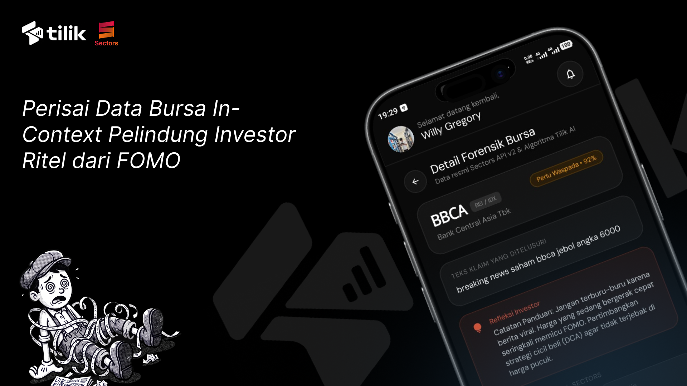

<div align="center">

<!-- =================== BANNER HERO =================== -->


<br/><br/>

<!-- =================== REPO & METRIC BADGES =================== -->
<a href="https://github.com/willgregorry/tilik-fe"></a>
<a href="https://github.com/sulthonaw/tilik-ai"></a>
<a href="https://sectors.app"></a>


<br/><br/>

<p align="center">
  <strong>Intelligence pipeline & multi-agent verification engine pemeriksa fakta bursa berbasis data resmi IDX & Sectors API.</strong><br/>
  Layanan backend pendeteksi misinformasi dan klaim spekulatif pasar modal Indonesia secara in-context dengan latensi rendah.
</p>

</div>

<br/>

<hr/>

<!-- =================== SECTION 01: OVERVIEW =================== -->
## <samp>// 01 — Overview</samp>

<table>
<tr>
<td width="65%" valign="top">

**Tilik AI Backend** adalah sistem mesin inferensi dan validasi finansial yang menguji keabsahan klaim, narasi spekulatif, serta eufemisme *pom-pom* saham emiten Bursa Efek Indonesia (BEI / IDX) yang beredar di media sosial (X/Twitter, Threads, dan Telegram).

Sistem ini mengekstraksi kode saham dan istilah gaul pasar modal melalui **Slang RAG Engine**, mengambil data fundamental terverifikasi dari **Sectors Financial API**, lalu menjalankan rantai penalaran berjenjang via **LangGraph** dan **Google Gemini 2.5 Flash**.

Hasil verifikasi disajikan dalam format **Dual-Level Payload**:
1. **Level 1 (Card Summary):** Vonis lampu lalu lintas (`SESUAI_FAKTA`, `WASPADA`, `HOAX_BAHAYA`), 1–3 poin ringkasan fakta kuantitatif, dan panduan objektif (*cooling-off prompt* untuk pemula atau *devil's advocate* untuk analis).
2. **Level 2 (Deep Forensic):** Data rasio valuasi peers, arus transaksi broker domestik vs asing, konsentrasi kepemilikan, dan status Papan Pemantauan Khusus (FCA) tanpa *latency* tambahan.

> **Kepatuhan Regulasi:** Layanan ini dirancang sesuai koridor POJK No. 6/2026 dan UU P2SK murni sebagai penyedia informasi fakta objektif (*factual information provider*), tanpa memberikan sinyal transaksi beli/jual maupun eksekusi pesanan otomatis (*Disclaimer On*).

</td>
<td width="35%" valign="top">

**Project Metadata**

| Key | Value |
|---|---|
| **Runtime** | Python 3.11+ |
| **Framework** | FastAPI + Uvicorn |
| **Data Validation** | Pydantic v2 |
| **Agent Framework** | LangGraph + LangChain |
| **LLM Engine** | Google Gemini 2.5 Flash |
| **Financial API** | Sectors Financial API v2 |
| **RAG Store** | ChromaDB (Vector Store) |
| **Database** | SQLite / SQLAlchemy (`tilik.db`) |
| **Cache Engine** | Redis + In-Memory TTLCache |

</td>
</tr>
</table>

<br/>

<!-- =================== SECTION 02: REPOSITORIES & ECOSYSTEM =================== -->
## <samp>// 02 — Ecosystem & Architecture</samp>

Sistem Tilik beroperasi dalam ekosistem terpadu yang memisahkan lapisan presentasi klien dari mesin kalkulasi data bursa:

| Repositori | Cakupan & Tanggung Jawab | Stack Teknologi | Tautan Repositori |
|---|---|---|---|
| **Tilik Android (Frontend)** | Antarmuka pengguna melayang (*floating bubble*), deteksi clipboard otomatis, modal bottom sheet, gesture physics, dan rendering kartu forensik bursa. | Kotlin 2.0, Jetpack Compose, Material 3, WindowManager Native, Retrofit 2, OkHttp 3 | [willgregorry/tilik-fe](https://github.com/willgregorry/tilik-fe) |
| **Tilik AI (Backend)** | Multi-agent state machine, resolusi istilah gaul (Slang RAG), integrasi Sectors API paralel, caching multi-tier, persistensi riwayat, dan verifikasi token OAuth. | Python 3.11, FastAPI, LangGraph, Google Gemini 2.5 Flash, Sectors API, SQLite | [sulthonaw/tilik-ai](https://github.com/sulthonaw/tilik-ai) |

### Alur Kerja Sistem (End-to-End Pipeline)

```text
[Media Sosial: Threads / X / Telegram]
                 │
                 ▼ (Salin Teks / Interaksi Pengguna)
[Tilik Android: Floating Overlay Client]
                 │
                 ▼ (POST /api/v1/verify — JSON Payload)
[Tilik AI Backend Gateway: FastAPI Service]
                 │
         ┌───────┴────────────────────────────────────────┐
         │ (1) Cache Layer (Hash SHA-256 / Redis)        │
         │ Hit -> Return Cached Verification             │
         │ Miss -> Trigger LangGraph Workflow            │
         └───────┬────────────────────────────────────────┘
                 ▼
[LangGraph Multi-Agent Pipeline]
   ├── 1. ner_slang         : Ekstraksi emiten & pencarian kemiripan di Slang Vector Store
   ├── 2. intent            : Klasifikasi kategori klaim (Valuation / Flow / Earnings / FCA)
   ├── 3. concurrent_fetch  : Pengambilan paralel data resmi via Sectors API (httpx asinkron)
   ├── 4. evaluator         : Komparasi klaim vs data fundamental & deteksi bias/pom-pom
   └── 5. synthesizer       : Pembentukan payload terstruktur Level 1 & Level 2
                 │
                 ▼ (JSON: VerdictLevel, FactCheckPoints, ExpandedDetails)
[Tilik Android: Render Bottom Sheet & Lembar Forensik Data]
```

<br/>

<!-- =================== SECTION 03: MULTI-AGENT INTELLIGENCE PIPELINE =================== -->
## <samp>// 03 — Multi-Agent Intelligence Pipeline</samp>

Verifikasi diproses melalui *directed acyclic graph* berbasis **LangGraph** yang memecah proses analisa menjadi simpul-simpul deterministik:

| Simpul Node | Tanggung Jawab Teknis | Mekanisme & Sumber Data |
|---|---|---|
| **`ner_slang`** | Mengidentifikasi kode saham resmi (ticker 4 huruf) serta memetakan eufemisme/julukan gaul bursa (*"si ijo"*, *"saham paman"*, *"diserok bandar"*). | Kamus data `data/slang_dictionary.csv` diindeks ke dalam ChromaDB vector store dengan pencarian semantik berbobot relevansi tinggi. |
| **`intent`** | Mengkategorikan klaim finansial ke dalam 4 dimensi evaluasi: Valuasi Saham, Aliran Dana & Broker, Kinerja Laba, atau Status Risiko Legal/Suspensi. | Gemini 2.5 Flash dengan skema keluaran terstruktur Pydantic. |
| **`concurrent_fetch`** | Mengambil data fundamental dan transaksi secara paralel menggunakan `httpx.AsyncClient` dengan pengoptimalan kuota Sectors API. | - `GET /v2/company/report/{symbol}/?sections=overview,valuation,financials,peers`<br/>- `GET /v2/broker-summary/{symbol}/top/?n_brokers=10`<br/>- `GET /v2/foreign-flow/{symbol}/`<br/>- `GET /v2/suspensions/?symbol={symbol}` |
| **`evaluator`** | Menghitung anomali antara angka klaim pengguna dengan data resmi bursa, membandingkan rasio terhadap median industri, dan mengecek notasi khusus FCA. | Evaluasi matriks deviasi, perbandingan net buy/sell broker ritel vs institusi, dan evaluasi kualitas laba operasional. |
| **`synthesizer`** | Membangun respons terstandarisasi yang memuat vonis akhir, fakta singkat maksimal 25 kata per poin, serta data teknis terperinci untuk Level 2. | Format JSON Pydantic v2 disesuaikan dengan profil pengguna (`PEMULA` atau `EXPERT`). |

<br/>

<!-- =================== SECTION 04: TECH STACK =================== -->
## <samp>// 04 — Tech Stack</samp>

<details open>
<summary><strong>Core Backend & Web Framework</strong></summary>
<br/>
<p>
  
  
  
  
  
</p>
</details>

<details open>
<summary><strong>AI, Agent Engine & Vector Store</strong></summary>
<br/>
<p>
  
  
  
  
</p>
</details>

<details open>
<summary><strong>Financial Data, Database & Caching</strong></summary>
<br/>
<p>
  
  
  
  
  
  
</p>
</details>

<br/>

<!-- =================== SECTION 05: API SPECIFICATION =================== -->
## <samp>// 05 — API Specification</samp>

Dokumentasi OpenAPI interaktif tersedia langsung saat server berjalan di `/docs` (Swagger UI) dan `/redoc` (ReDoc).

### Ringkasan Endpoint Utama

| Metode | Jalur Endpoint | Deskripsi & Kegunaan | Autentikasi |
|---|---|---|---|
| `POST` | `/api/v1/verify` | Memverifikasi klaim saham dari teks media sosial secara multi-agent. | Opsional (Guest / Bearer Token) |
| `GET` | `/api/v1/history` | Mengambil daftar riwayat hasil verifikasi pengguna dengan paginasi. | Opsional (Mendukung ID perangkat/user) |
| `GET` | `/api/v1/history/{id}` | Mengambil data forensik mendalam (Level 1 + Level 2) dari item riwayat tertentu. | Opsional |
| `DELETE` | `/api/v1/history/{id}` | Menghapus catatan riwayat verifikasi tertentu dari database. | Opsional |
| `GET` | `/api/v1/markets` | Mengambil ikhtisar emiten BEI, ringkasan top movers, dan metrik sektor. | Terbuka / Public |
| `POST` | `/api/v1/auth/google` | Verifikasi Google ID Token dan penerbitan token sesi JWT. | Terbuka / Public |
| `GET` | `/api/v1/health` | Pemeriksaan kesehatan layanan, status koneksi Sectors API, Gemini, dan Cache. | Terbuka / Public |

### 1. Endpoint Verifikasi Klaim

`POST /api/v1/verify`

**Request Headers:**
```http
Content-Type: application/json
Authorization: Bearer <jwt_access_token> (Opsional)
```

**Request Body:**
```json
{
  "text": "BBCA valuasi lagi murah banget, asing tercatat serok masif hari ini!",
  "source_platform": "x",
  "user_role": "PEMULA"
}
```

**Response Body (200 OK):**
```json
{
  "id": "hist_b19fa2c4-7261-45df-9d3e-9080b03e221f",
  "ticker": "BBCA",
  "company_name": "Bank Central Asia Tbk",
  "verdict_level": "WASPADA",
  "confidence_score": 0.88,
  "level_1_summary": {
    "points": [
      {
        "title": "Valuasi Relatif",
        "fact": "PBV emiten tercatat 4,2x, lebih tinggi dibanding median sektor perbankan sebesar 1,8x.",
        "is_favorable": false
      },
      {
        "title": "Aliran Dana Asing",
        "fact": "Asing mencatatkan net buy Rp 145 Miliar pada perdagangan hari ini.",
        "is_favorable": true
      }
    ],
    "cooling_off_prompt": "Harga saat ini berada di atas rata-rata historis industrinya. Pastikan keputusan beli didasari horizon investasi jangka panjang, bukan ketergesaan informasi."
  },
  "level_2_details": {
    "valuation": {
      "pe_ratio": 22.4,
      "pbv_ratio": 4.2,
      "industry_median_pe": 13.5,
      "industry_median_pbv": 1.8,
      "valuation_status": "Premium terhadap industri"
    },
    "broker_flow": {
      "foreign_net_idr": 145000000000,
      "top_buyers": [
        {"broker_code": "AK", "broker_type": "Asing", "net_value_idr": 92000000000, "action": "NET_BUY"}
      ],
      "top_sellers": [
        {"broker_code": "YP", "broker_type": "Ritel Domestik", "net_value_idr": 48000000000, "action": "NET_SELL"}
      ]
    },
    "fca_status": {
      "is_fca": false,
      "notation_code": null,
      "reason": "Saham diperdagangkan normal di Papan Utama"
    }
  },
  "created_at": "2026-10-08T13:30:00Z"
}
```

<br/>

<!-- =================== SECTION 06: GETTING STARTED =================== -->
## <samp>// 06 — Getting Started</samp>

### Prasyarat Pengembangan

- **Python Runtime:** Python 3.11 atau lebih baru.
- **Package Manager:** `pip` versi mutakhir.
- **API Keys:**
  - Kunci API Google Gemini (Google AI Studio).
  - Kunci API Sectors Financial ([sectors.app](https://sectors.app)).
- **Opsional (Kontainerisasi):** Docker Engine & Docker Compose v2.

### 1. Kloning Repositori

```bash
git clone https://github.com/sulthonaw/tilik-ai.git
cd tilik-ai
```

### 2. Konfigurasi Lingkungan (`.env`)

Salin berkas template lingkungan ke berkas aktif `.env`:

```bash
# Linux / macOS / Git Bash
cp .env.example .env

# Windows (Command Prompt)
copy .env.example .env

# Windows (PowerShell)
Copy-Item .env.example .env
```

Buka `.env` dan lengkapi konfigurasi variabel lingkungan:

```properties
# Server Core
APP_NAME=Tilik AI Backend
APP_ENV=development
DEBUG=True
PORT=8000
HOST=0.0.0.0

# Google Gemini API
GOOGLE_API_KEY=your_google_gemini_api_key_here
GEMINI_API_KEY=your_google_gemini_api_key_here
GEMINI_MODEL=gemini-2.5-flash

# Sectors Financial API v2
SECTORS_API_KEY=your_sectors_api_key_here
SECTORS_API_BASE_URL=https://api.sectors.app

# Database & Cache
DATABASE_URL=sqlite:///./tilik.db
ENABLE_REDIS=False
REDIS_URL=redis://localhost:6379/0

# Security & Auth
JWT_SECRET_KEY=your_random_secret_jwt_key_here
JWT_ALGORITHM=HS256
GOOGLE_CLIENT_ID=your_google_client_id_here
```

### 3. Instalasi & Menjalankan via Virtual Environment (venv)

#### Langkah A — Buat dan Aktifkan Virtual Environment

* **Windows (PowerShell):**
  ```powershell
  python -m venv venv
  .\venv\Scripts\Activate.ps1
  ```
* **Windows (Command Prompt):**
  ```cmd
  python -m venv venv
  .\venv\Scripts\activate.bat
  ```
* **Linux / macOS:**
  ```bash
  python3 -m venv venv
  source venv/bin/activate
  ```

#### Langkah B — Pasang Dependensi

```bash
pip install --upgrade pip
pip install -r requirements.txt
```

#### Langkah C — Jalankan Server Aplikasi

```bash
uvicorn main:app --reload --port 8000
```
*(Alternatif menggunakan modul: `python -m uvicorn app.main:app --reload --port 8000`)*

Server akan aktif dan siap menerima request di:
- **API Root:** `http://localhost:8000`
- **Swagger UI Interactive Docs:** `http://localhost:8000/docs`
- **ReDoc Interactive Docs:** `http://localhost:8000/redoc`

### 4. Menjalankan via Docker & Docker Compose

Untuk lingkungan terisolasi dengan kontainer Redis terintegrasi:

```bash
# Build dan jalankan service di latar belakang
docker compose up -d --build

# Pantau log service backend
docker compose logs -f tilik-backend

# Matikan seluruh service
docker compose down
```

### 5. Verifikasi Konektivitas (Health Check)

Pastikan seluruh komponen terhubung normal:

```bash
curl http://localhost:8000/api/v1/health
```

Contoh respon:
```json
{
  "status": "healthy",
  "app_name": "Tilik AI Backend",
  "version": "2.0.0",
  "gemini_api": "connected",
  "sectors_api": "connected",
  "slang_rag_records": 52
}
```

<br/>

<!-- =================== SECTION 07: DIRECTORY STRUCTURE =================== -->
## <samp>// 07 — Directory Structure</samp>

```text
tilik-ai/
├── app/
│   ├── agent/                            # LangGraph multi-agent workflow
│   │   ├── graph.py                      # Definisi StateGraph & kompilasi alur verifikasi
│   │   ├── nodes.py                      # Logika simpul agent (NER, intent, evaluator, synthesizer)
│   │   └── prompts.py                    # Template prompt inferensi finansial Gemini
│   ├── api/
│   │   └── v1/
│   │       └── endpoints.py              # Routing endpoint (/verify, /history, /markets, /auth)
│   ├── core/
│   │   ├── cache.py                      # Engine hybrid cache (Redis + in-memory TTLCache)
│   │   ├── config.py                     # Pydantic BaseSettings & konfigurasi aplikasi
│   │   └── security.py                   # Token verifikasi Google OAuth, JWT, & rate limiting
│   ├── models/
│   │   ├── schemas.py                    # Skema data Pydantic v2 (Request, Response, Verdict)
│   │   └── state.py                      # Kontrak AgentState untuk StateGraph LangGraph
│   ├── rag/
│   │   ├── retriever.py                  # Semantic similarity search slang pasar modal
│   │   └── slang_store.py                # ChromaDB vector store bindings & inisialisasi CSV
│   ├── services/
│   │   ├── history_service.py            # Pengelola persistensi riwayat verifikasi pengguna
│   │   ├── sectors_client.py             # Klien asinkron Sectors Financial API v2 (HTTPX)
│   │   └── user_service.py               # Pengelola preferensi pengguna (PEMULA / EXPERT)
│   └── main.py                           # FastAPI application factory, middleware, & lifespan
├── data/
│   ├── chroma_db/                        # Direktori penyimpanan vektor ChromaDB
│   └── slang_dictionary.csv              # Database kamus slang, eufemisme, & broker IDX
├── tests/                                # Rangkaian pengujian terotomatisasi (pytest)
├── banner.jpg                            # Banner dokumentasi proyek
├── client_secret.json                    # Konfigurasi Google OAuth Client
├── docker-compose.yml                    # Konfigurasi orkestrasi kontainer (Backend + Redis)
├── Dockerfile                            # Blueprint image produksi kontainer backend
├── main.py                               # Root ASGI entrypoint forwarding
├── pyproject.toml                        # Konfigurasi toolchain Python
├── README.md                             # Berkas dokumentasi utama proyek
└── requirements.txt                      # Daftar dependensi modul Python
```

<br/>

<!-- =================== FOOTER =================== -->
<hr/>

<table width="100%">
<tr>
<td align="left">
  <sub><strong>Tilik AI</strong> — In-Context Stock Fact-Checker for IDX &middot; Backend Repository</sub>
</td>
<td align="right">
  <a href="https://github.com/willgregorry/tilik-fe"></a>
  <a href="https://github.com/sulthonaw/tilik-ai"></a>
</td>
</tr>
</table>
